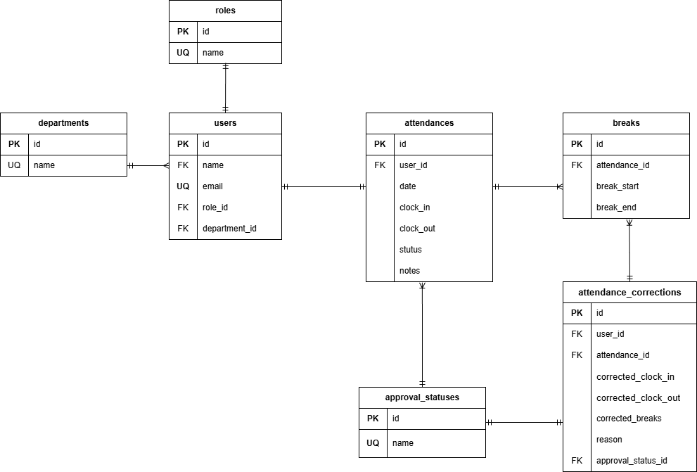

# KINTIME（勤怠管理アプリ）

Laravel + Docker 環境で構築した勤怠管理アプリケーションです。

---

## 概要

KINTIME は、従業員の勤怠打刻・勤怠一覧表示・修正申請・管理者承認を行うための勤怠管理アプリです。

- 一般ユーザー：出勤 / 退勤 / 勤怠確認 / 修正申請
- 管理者：スタッフ一覧 / 勤怠一覧 / 修正申請承認

---

## 使用技術

- PHP 8.3.x
- Laravel 8.x
- MySQL 8.0.x
- Docker / docker-compose
- Nginx
- phpMyAdmin
- MailHog（開発用メール確認）

---

## 環境構築手順（Makefile 利用・推奨）

### 1. リポジトリをクローン

```bash
git clone git@github.com:ToshiyaTaguchi/KINTIME.git
cd Kintime
```

---

### 2. 初期セットアップ（最初に 1 回だけ）

```bash
make init
```

このコマンドで以下が自動実行されます。

- Docker コンテナのビルド・起動
- composer install
- .env ファイル作成（存在しない場合）
- アプリケーションキー生成
- マイグレーション & シーディング
- storage シンボリックリンク作成

---

## よく使う Make コマンド

| 内容             | コマンド     |
| ---------------- | ------------ |
| コンテナ起動     | make up      |
| コンテナ停止     | make down    |
| 再起動           | make restart |
| DB 初期化        | make fresh   |
| キャッシュクリア | make cache   |

---

## Laravel 環境変数（.env）

`.env.example` をコピーして作成される `.env` に以下を設定してください。

### Database

```env
DB_CONNECTION=mysql
DB_HOST=mysql
DB_PORT=3306
DB_DATABASE=laravel_db
DB_USERNAME=laravel_user
DB_PASSWORD=your_password
```

### MailHog

```env
MAIL_MAILER=smtp
MAIL_HOST=mailhog
MAIL_PORT=1025
MAIL_USERNAME=null
MAIL_PASSWORD=null
MAIL_ENCRYPTION=null
MAIL_FROM_ADDRESS=no-reply@example.com
MAIL_FROM_NAME=KINTIME
```

---

## アクセス URL

- アプリケーション：http://localhost
- phpMyAdmin：http://localhost:8080
- MailHog：http://localhost:8025

---

## ER 図



---

## 補足

- 本プロジェクトでは vendor ディレクトリを Git 管理していないため、`make init` 時に composer install を実行します。
- storage / bootstrap/cache の権限調整は Makefile 内で対応しています。

---
